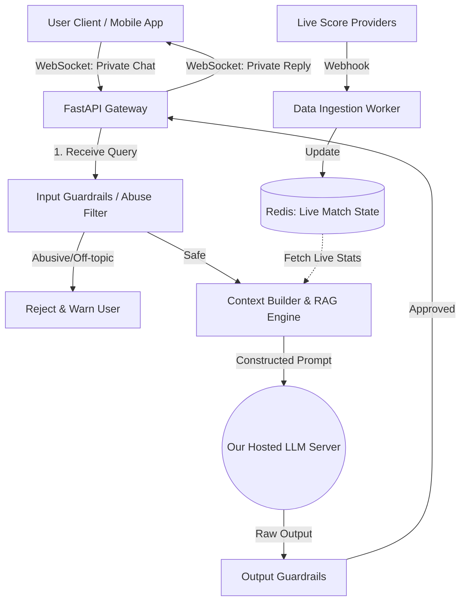

# Duggy AI: Private Cricket Chatbot & Moderation Architecture

## 1. Executive Summary
This document outlines the architecture for **Duggy AI**, a proprietary, isolated AI chatbot system for the DugOut platform. Based on the latest team requirements, this architecture ensures:
1. **"Our Own Model":** Deployment of a privately hosted Open-Source LLM (e.g., Llama 3 or Mistral) to maintain data privacy, control over responses, and avoid third-party rate limits.
2. **Private 1-on-1 Interactions:** Chatbot responses are isolated to the specific user asking the query. The bot does not reply in the public stands/chatrooms to avoid spamming other users.
3. **Live Match Awareness:** The bot is continuously fed live match data (ball-by-ball) to answer real-time questions.
4. **Strict Guardrails & Abuse Detection:** Input and output filters to detect abusive language, toxicity, and ensure the bot only answers cricket-related queries.

---

## 2. High-Level Architecture Diagram

---

## 3. Step-by-Step System Flow

### Step 1: User Query & Private Channel Setup
*   **Mechanism:** When a user wants to talk to the AI, they open a dedicated "Duggy Chat" tab (a private 1-on-1 interface, distinct from the public "Stands").
*   **Connection:** A dedicated WebSocket connection is established (`ws://api.dugout.com/chat/ai/{user_id}`). This ensures no other users see the prompts or the answers.

### Step 2: Input Guardrails & Abuse Detection (Pre-processing)
Before the query reaches the expensive AI model, it passes through a lightweight moderation layer.
*   **Profanity/Toxicity Filter:** Uses a fast, lightweight local classifier (e.g., HuggingFace's `toxic-bert`) or exact-match regex to instantly detect abusive words.
*   **Topic Restriction (Domain Guardrail):** A small classifier checks if the question is about Cricket. If a user asks "Write a Python script" or "What is the capital of France?", the system blocks it with: *"I am a cricket specialist! Ask me about the live match, stats, or players."*

### Step 3: Live Match Context Retrieval (RAG Pipeline)
If the query is safe, the system fetches real-time data to answer accurately.
*   **Live Redis Cache:** A background worker continuously updates Redis with the latest match score, current batters, bowlers, and recent balls.
*   **Prompt Construction:** The system dynamically injects this live data into the prompt.
    *   *Example System Prompt:* "You are Duggy. The current match is CSK vs MI. CSK is 120/2 in 14 overs. User asks: [User Query]."

### Step 4: "Our Own Model" Generation
*   **Self-Hosted LLM:** Instead of calling OpenAI or Gemini APIs directly over the public internet, we deploy an open-weight model (like **Meta Llama-3-8B-Instruct** or **Mistral-7B**) on our own cloud infrastructure (using vLLM or Ollama for fast inference).
*   **Benefits:** Complete ownership of data, zero risk of third-party API changes, and ability to fine-tune the model exclusively on cricket terminology later.

### Step 5: Output Guardrails (Post-processing)
*   **Sanity Check:** Ensure the model didn't hallucinate non-safe content or generate toxic replies.
*   **Formatting:** Format the response in clean Markdown (with emojis) and stream it back to the specific user via their private WebSocket.

---

## 4. Implementation Phasing (How to build it)

### Phase 1: Local Setup & Model Deployment
1.  **Model Hosting:** Setup a local Python environment. Install `ollama` or `vLLM` to run a local model (e.g., Llama 3) to act as "our own model".
2.  **FastAPI Backend:** Create the `/ai-chat` WebSocket endpoint in `app/main.py` that connects the frontend to the local LLM.

### Phase 2: Guardrails & Moderation
1.  **Abuse Detection:** Integrate a Python library (like `better_profanity` for V1, moving to `transformers` toxicity models for V2) in the FastAPI pipeline.
2.  **Topic Enforcement:** Implement a prompt-wrapper that strictly instructs the LLM to refuse non-cricket topics.

### Phase 3: Live Data Injection
1.  **Mock Live Data:** Create a background task in FastAPI that simulates live cricket score updates into a dictionary/Redis.
2.  **Context Builder:** Write the Python logic that pulls this mock data and prepends it to the user's prompt before sending it to the LLM.

### Phase 4: Frontend Integration
1.  **UI Update:** Add a floating action button or a dedicated tab in `static/index.html` for the private Duggy AI chat.
2.  **WebSocket Client:** Write the JavaScript in `static/js` to send messages and receive streamed text privately.

---

## 5. Summary of Technologies Required
*   **Backend Framework:** FastAPI (Python)
*   **AI Model Server:** Ollama (for local dev) / vLLM (for production deployment of Llama-3)
*   **Real-time Comms:** WebSockets (via FastAPI)
*   **In-Memory State (Live Data):** Redis
*   **Moderation:** `toxic-bert` (HuggingFace) or `NeMo Guardrails`
